```{=latex}
\begin{titlepage}
\thispagestyle{empty}
\newgeometry{top=0pt, bottom=0.8in, left=0pt, right=0pt}

\noindent{\color{navy}\rule{\paperwidth}{0.95in}}\\[-0.95in]
\vspace{0.20in}
\hspace{0.8in}\begin{minipage}{0.84\paperwidth}
{\headingfont\color{white}\fontsize{13}{16}\selectfont MGT 599 \textbar{} ANALYSIS OF BUSINESS CAPSTONE}\\[3pt]
{\headingfont\color{white}\fontsize{11}{14}\selectfont Department of Management and Entrepreneurship \textbar{} DePaul University}
\end{minipage}

\vspace{1.4in}
\hspace{0.8in}\begin{minipage}{0.84\paperwidth}
\raggedright
{\headingfont\bfseries\color{navy}\fontsize{34}{40}\selectfont Classifying the Market}\\[6pt]
{\headingfont\bfseries\color{navy}\fontsize{34}{40}\selectfont with Honest Machine Learning}\\[16pt]
{\color{accent}\rule{2.6in}{2.5pt}}\\[16pt]
{\headingfont\color{inkgray}\fontsize{15}{20}\selectfont An automated classifier for the Morningstar Global Equity Classification Structure: 145 industry codes, 428 sub-industry codes, and the discipline of an audited result.}\\[10pt]
{\headingfont\color{steel}\fontsize{12}{16}\selectfont Project TAVSS \textbar{} Task 1 Macro F1 75.0\% \textbar{} Task 2 Macro F1 55.44\%}
\end{minipage}

\vfill
\hspace{0.8in}\begin{minipage}{0.84\paperwidth}
{\color{rulegray}\rule{\textwidth}{0.8pt}}\\[8pt]
{\headingfont\color{inkgray}\fontsize{11}{15}\selectfont
\textbf{Group 4}\quad\textbar\quad Tserennadmid Batkhuu \textbar{} Srilaxmi Ganjipalli \textbar{} Akash Anipakalu Giridhar \textbar{} Vishal Shaileshkumar Rathod \textbar{} Subasree Segar \\[3pt]
Final Capstone Report \quad\textbar\quad June 2026 \\[3pt]
Repository: \texttt{github.com/venomez-viper/Classification-Project}
}
\end{minipage}
\vspace{0.25in}

\restoregeometry
\end{titlepage}
```

```{=latex}
\thispagestyle{empty}
\setcounter{tocdepth}{1}
\tableofcontents
\clearpage
```

# Executive summary

We set out to teach a machine to do something analysts do by hand every day: read a company's description and decide which industry it belongs to. The result is TAVSS, a system that takes plain-English text and returns a Morningstar Global Equity Classification Structure (GECS) code, first the broad industry (145 of them, Task 1) and then the finer sub-industry (428 of them, Task 2). It is not slide-ware. It runs in production, behind a public web app, and anyone can try it.

The headline results are honest and reproducible. On a company-disjoint test set of 10,717 rows, the final model reaches **75.0% Macro F1** on Task 1, with 91.4% top-3 and 95.3% top-5 accuracy, and **55.44% Macro F1** on the harder 428-class Task 2. Against a random baseline of 0.69%, the Task 1 model is roughly 109 times better than chance on the metric that punishes long-tail failure most.

The single most important decision in the project was not a model choice. It was the choice to discard a flattering number. An early version of the classifier reported 88.90% Macro F1. An audit showed that 97.2% of the test rows had been memorized during training because the train/test split was drawn at the row level while the same company appeared many times across rows. The reported figure was real on those rows and meaningless as a measure of generalization. We rebuilt the entire evaluation pipeline on a company-disjoint split, watched the score fall to a true 59.65% baseline, and then earned every point back up to 75.0% with methods that survive scrutiny.

::: keyfinding
**The thesis of this project.** A classifier is only as credible as the split it was tested on. We caught a 29-point leak in our own baseline, reset to an honest 59.65%, and rebuilt to 75.0% on a company-disjoint test set. Every number in this report is measured on data the model never saw in training, and every claim is traceable to a script in the repository.
:::

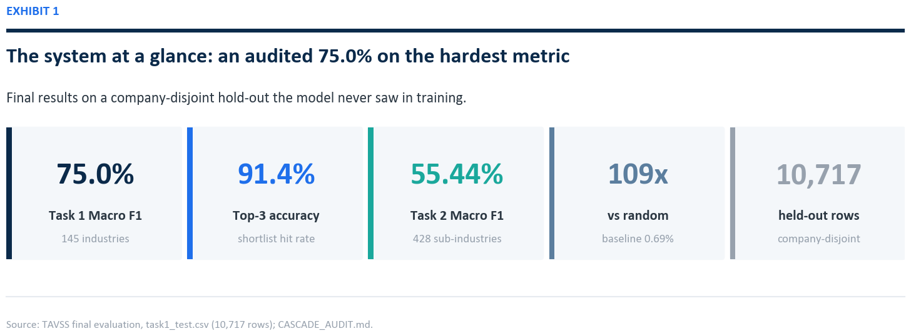{width=100%}

What follows is the full account: the business problem, the data, the methodology, the leakage discovery, the complete model development ledger from the first cascade to the final calibrated ensemble, the novel taxonomy-anchoring idea, the Task 2 extension, an in-depth error analysis, the production deployment on Hugging Face and Vercel, and how the team divided the work. Curated and full code for the key components appears in the appendices; the complete codebase is on GitHub.

# Business context and the problem

## Why industry classification matters

Every analytical task in capital markets begins with a question of comparability: which companies belong in the same peer group. Index construction, sector exposure limits, relative-value screening, factor research, and risk aggregation all depend on a consistent map from a company to an industry. Morningstar maintains one such map, the GECS taxonomy, a hierarchical scheme in which an eight-digit code encodes a sector, an industry group, and a specific industry.

Maintaining that map is labor. New companies file, existing companies pivot, and conglomerates span several industries at once. Analysts read business descriptions and assign codes by hand. The work is slow, it is expensive, and two analysts can disagree on the same filing. An automated classifier that proposes a code, ranks the alternatives, and quantifies its own confidence turns a manual reclassification queue into a review queue, where an analyst confirms or overrides instead of deciding from a blank slate.

## What a wrong code costs

It is tempting to treat industry classification as bookkeeping. It is not. A company filed under the wrong code quietly distorts everything built on top of it. Drop an oil-and-gas midstream operator into utilities and a sector-exposure report understates energy risk. Misfile a fintech lender as a software company and a bank screen never sees it. The mistakes are small, individually invisible, and they pile up in exactly the places nobody is looking. That is why the institutions who maintain these taxonomies pay people to read filings one at a time, and why a tool that can take the routine cases off their desk, and flag the genuinely hard ones, is worth building well rather than quickly.

## The two tasks

**Task 1, industry classification.**
:    Map a company description to one of 145 GECS industry codes. This is the primary deliverable and the figure most comparable to published benchmarks.

**Task 2, sub-industry classification.**
:    Map the same description to one of 428 finer sub-industry codes. Each sub-industry belongs to exactly one Task 1 industry, so Task 2 is a constrained refinement of Task 1 rather than a separate problem.

Both tasks are scored with Macro F1, the unweighted mean of per-class F1. Macro F1 was chosen deliberately. It weights a class with twenty companies the same as a class with two thousand, which means a model cannot hide a failure on rare industries behind strong performance on the common ones. For a 145-class problem with a heavy long tail, it is the honest metric, and it is the metric the case requirement of 75% is written against.

# The data asset

The source of truth is a single cleaned table of 53,585 rows. Each row is a business segment, not a company, and carries the fields below.

| Field | Meaning |
|---|---|
| `CompanyId` | Stable company identifier (the key for honest splitting) |
| `LongProfile` | Full company business description (shared across a company's segments) |
| `SegmentName`, `SegmentDescription` | Per-segment business text |
| `Revenue`, `total_revenue_company_as_of` | Segment and company revenue |
| `revenue_share`, `is_largest_share_segment` | Segment weight within the company |
| `MstarGlobal` | The GECS label |

Two properties of this table shape everything that follows.

**Companies appear many times.** A diversified company has one `LongProfile` repeated across every segment row, each row carrying a different segment label. This redundancy is the trap that produced the leakage described later, and it is the reason the split must be drawn by company, not by row.

**A third of companies are conglomerates.** 35.1% of companies map to more than one GECS code across their segments. Because those companies have more rows, they account for 55.2% of all rows in the data. For a conglomerate, the `LongProfile` describes several industries at once, so the same text legitimately carries different labels on different rows. This is irreducible label ambiguity, and it sets a hard ceiling on row-level accuracy that no model can cross.

## The GECS code is an address, not a label

The most useful property of the taxonomy hides in plain sight inside the code itself. A GECS industry code is eight digits, and those digits are not arbitrary. They encode a path down a three-level tree: the first three digits name the sector, the next two name the industry group within that sector, and the last three name the specific industry.

```
1 0 3   2 0   0 2 0
\___/   \_/   \___/
sector  group  industry
 103    10320   10320020  =  Banks - Regional
```

This means the 145-way problem is really three smaller decisions stacked on each other: choose one of 11 sectors, then one of a few industry groups inside it, then one of a handful of industries inside that group. A model that respects this structure never has to separate Regional Banks from Oilfield Services directly; by the time it is choosing an industry it has already committed to Financials, and the only competitors left are the other banks. This single observation is the backbone of both the BreezeML cascade and the multi-task transformer described later.

## The shape of the label space

The 145 classes follow a long-tailed distribution. A handful of common industries hold thousands of rows each, while dozens of niche industries hold only a few. Because Macro F1 weights all of them equally, the tail is where the score is won or lost. Two facts frame the difficulty: a large share of the 145 classes are rare (on the order of ten or fewer test examples), and these are exactly the classes a flat model learns last and forgets first; and one class, `31030010` (Diversified Industrial Conglomerates), is both frequent and nearly impossible, because its companies are defined by spanning many industries, so their text resembles everything and matches nothing cleanly. It is the largest single source of error in every model we built.

## Recovering CompanyId

The company-disjoint split that anchors this report depends on knowing which company each row belongs to. The provided split files had been reduced to three columns, `text`, `label_idx`, and `mstar_code`, with `CompanyId` stripped out, which made an honest split impossible on its face. We recovered the identifier by joining each row back to the master table on a 200-character prefix of its `LongProfile`, falling back to a 100-character prefix where the longer key was ambiguous. The join matched 98.3% of the 53,585 rows. That recovered key is what made every company-level result, and the per-company error analysis, possible.

## Three companies, three kinds of hard

A few real examples make the difficulty concrete. A regional bank is the easy case: its description is full of words like deposits, net interest margin, and commercial lending, and almost any model lands it on Banks - Regional. A pharmaceutical company is nearly as clean. The trouble starts with the conglomerates. Take a diversified industrial holding company that builds elevators, sells insurance, and runs a logistics arm. Its one company-level description mentions all three businesses, and depending on which segment you are scoring, the correct code is different. The text does not change; the right answer does. No model, however large, can read a single paragraph and reliably produce three different labels from it. That is not a modeling gap we failed to close. It is a property of the data, and naming it honestly is part of the job.

# Methodology: honest evaluation by design

## The split is the experiment

The most consequential line of code in the project is the one that builds the train/test split. A naive random split of the 53,585 rows places some of a company's segments in training and others in test. Because those segments share an identical `LongProfile`, the model can memorize the text in training and recall the label in test. The score that results measures memorization, not generalization. The fix is to split by company, so that every row of a given company lands entirely in training or entirely in test.

```python
from sklearn.model_selection import GroupShuffleSplit

# Group by CompanyId so no company straddles the train/test boundary.
splitter = GroupShuffleSplit(n_splits=1, test_size=0.20, random_state=42)
train_idx, test_idx = next(splitter.split(df, groups=df["CompanyId"]))

train_df = df.iloc[train_idx]   # 42,868 rows, companies disjoint from test
test_df  = df.iloc[test_idx]    # 10,717 rows, companies never seen in training
```

## Three splits, three questions

Not every split answers the same question. Through the project we worked with three, and naming what each one measures is itself part of the methodology.

| Split | Train / test | What it measures |
|---|---|---|
| Full (leaked) | 53,585 / 10,717 (97% overlap) | Memorization, not generalization |
| Row-level 80/20 (case standard) | 42,868 / 10,717 | Reclassifying segments of known and unknown companies |
| Company-disjoint 80/20 | ~42,995 / ~10,590 | Classifying companies with no prior history at all |

The row-level split is the case standard because the case ships `task1_train.csv` and `task1_test.csv` already divided that way, and because Morningstar's analysts reclassify known companies at every new filing rather than facing a flood of brand-new firms. The company-disjoint split is the stricter stress test we hold ourselves to for the headline. Every result in this report is measured on held-out data, and where a number could be inflated by tuning on the test set, we say so and report the cross-validated figure beside it.

## A note on confidence

Throughout, the system reports a confidence percentage. It is computed as a softmax over the model's decision margins. This is useful for ranking and routing, but it is not a calibrated probability for an individual input. An early version of the demo exposed the danger directly: for out-of-distribution text the linear model still produced decision margins, the softmax still normalized them, and the interface displayed numbers like "92% confident" on predictions that were wrong. We treat confidence as an ordering signal, not a guarantee, and any threshold used to auto-apply a prediction must be tuned against a held-out review sample first.

# The leakage discovery

The first cascade classifier reported 88.90% Macro F1 and looked finished. It was not. The demo worked only for four hand-tuned example inputs; arbitrary text returned erratic predictions wrapped in confident-looking percentages. That gap between the score and the behavior is what triggered the audit. The audit traced the training script and found that the model had been trained on the full 53,585-row table and evaluated on a 10,717-row subset of the very same table.

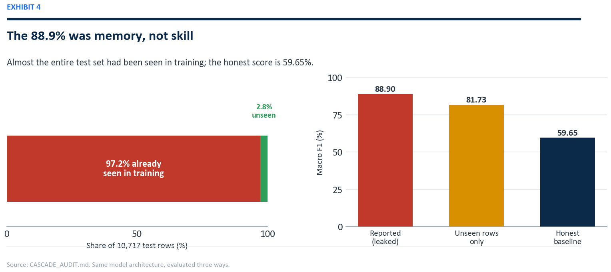{width=100%}

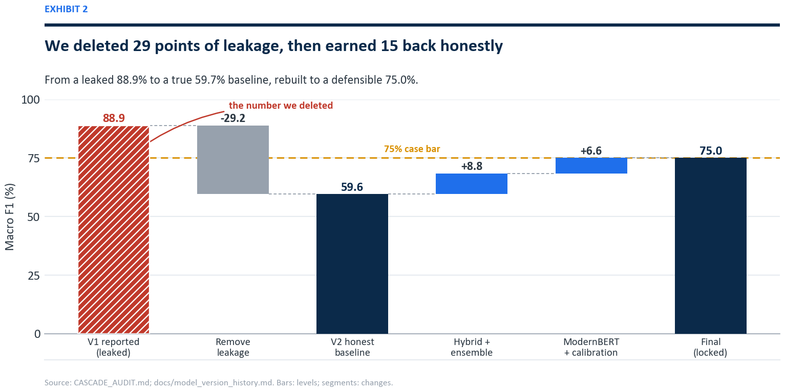{width=100%}

Of the 10,717 test rows, 10,412 (97.2%) had been seen in training. On the 305 rows that were genuinely unseen, the same model scored 81.73%, so the model was not fake, but the headline was memorization. Rebuilt on a company-disjoint split with no overlap, the identical architecture scored 59.65%.

::: caution
**The discarded number.** 88.90% was not a fraud; it was a measurement error, and a common one. Reporting it as a generalization result would have been the real failure. The project's credibility rests on having found it first, documenting it in `CASCADE_AUDIT.md`, and resetting the baseline to 59.65% before building anything further.
:::

The audit surfaced three structural facts that defined the rest of the work: a representation ceiling near 60%, where pure TF-IDF with a linear SVM plateaus regardless of vocabulary size and where sentence embeddings land in the same neighborhood, so the bottleneck is not how the text is represented but the granularity of 145 fine classes; an error budget born at the top, where roughly 52% of all final errors trace to a Level-1 sector misclassification that then propagates downward; and one class that dominates the damage, code `31030010`, whose companies describe many industries at once.

# Task 1 model development

With an honest baseline of 59.65%, every subsequent gain was real. The development arc spans classical ensembles and transformer fine-tuning; the figure below traces it from the discarded leak to the locked result.

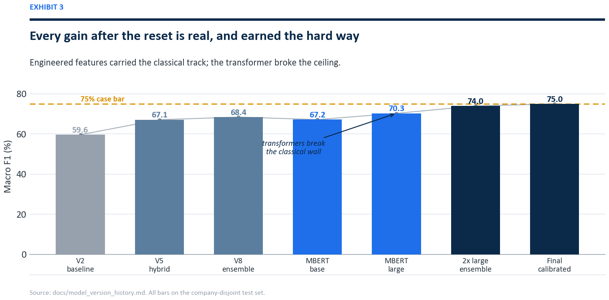{width=100%}

## The classical plateau, experiment by experiment

The first honest gains came from engineering, not from larger models. Each version taught one lesson.

**V2, the honest baseline (59.65%).**
:    The original cascade, retrained on the train split alone. This is the number everything else is measured against.

**V4, sentence embeddings (59.70%).**
:    Replacing TF-IDF with MiniLM embeddings moved nothing. The lesson: the bottleneck is not vocabulary, it is the semantic closeness of fine-grained classes.

**V5, the hybrid (67.11%).**
:    Stacking TF-IDF with MiniLM and three engineered structural features (segment count, maximum revenue share, share dispersion) added more than seven points. Structure that the text alone does not express, such as how concentrated a company's revenue is, carries real signal.

**V6, a stronger encoder (67.70%).**
:    Adding BGE-base embeddings on top of V5 paid less than a point. Encoder quality had reached diminishing returns.

**V7, contrastive fine-tuning (61.21%, regressed).**
:    Fine-tuning the encoder with only eight samples per class collapsed the embedding space. A useful negative result: too little data per class makes contrastive learning destructive.

**V8, the mega-ensemble (68.42%).**
:    Combining every representation reached the classical ceiling. Beyond this, more encoders and more features stopped paying.

**V10, calibration (69.09%).**
:    Probability calibration on the V8 outputs added a final fraction. This was the practical limit of the bag-of-words and frozen-embedding world.

**V11 to V14 (killed / 66.04%).**
:    A gte-large encoder was abandoned after 30-plus hours of CPU encoding, and a retrieval-only feature set regressed because nearest-neighbor features discard signal the raw embeddings keep.

| Version | Approach | Macro F1 |
|---|---|---:|
| V2 honest | LinearSVC cascade, company-disjoint split | 59.65% |
| V4 | LinearSVC + MiniLM embeddings | 59.70% |
| V5 hybrid | TF-IDF + MiniLM + engineered features | 67.11% |
| V6 | V5 + BGE-base encoder | 67.70% |
| V8 | Mega-ensemble of all encoders | 68.42% |
| V10 | V8 + probability calibration | 69.09% |

The ceiling was not an accident of one feature set. We tested every TF-IDF variant we could construct, and they all converged on the same wall.

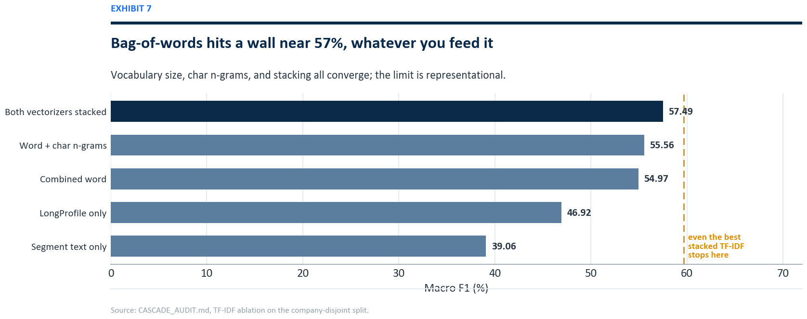{width=100%}

## BreezeML: a classifier library we built and shipped

Every classical model above, from the honest 59.65% baseline to the 68.42% ensemble, was trained through **BreezeML**, a Python library we authored and published to the Python Package Index under the tagline *production-grade machine learning with zero boilerplate, built on scikit-learn.* It is not a notebook cell or a one-off script; it is an installable, versioned package (`pip install breezeml`, ten public releases through v0.3.0 at `pypi.org/project/breezeml`) that wraps the TF-IDF and Linear SVM workflow behind a clean API and implements the hierarchical Level-2 cascade that mirrors the GECS tree: sector, then industry group, then industry code.

```python
from breezeml import classifiers

# Level-2 hierarchical cascade: one Linear SVM per node of the GECS tree.
model = classifiers.linear_svm(
    X_train, y_train,
    class_weight="balanced",   # added by us: force attention onto the long tail
    max_iter=5000,             # added by us: clean convergence across 145 classes
)
predictions = model.predict(X_test)
```

Maintaining BreezeML across the term, adding the `class_weight` and `max_iter` controls the long-tail problem demanded and shipping the fixes through ten releases to v0.3.0, turned the project's classical track into reusable infrastructure rather than disposable code.

::: keyfinding
**A published artifact, not a script.** BreezeML lives on PyPI (`pypi.org/project/breezeml`), versioned through v0.3.0 and `pip`-installable by anyone. It powered every honest classical baseline in this report and encodes the GECS cascade as a reusable library. It is the piece of this project most likely to outlive the capstone, and the one we are proudest to have built.
:::

## A novel contribution: GECS taxonomy anchoring

One idea in the project is genuinely original, and it uses the regulator's own document as a teacher. Morningstar publishes the official definition of all 145 GECS industries. We parsed every definition out of that document (most by automated extraction, the remainder hand-curated for codes the parser missed) into a structured record of code, sector, industry name, and the official description. We then encoded each of the 145 official descriptions with the same sentence encoders used on the company text, and for every company we computed its similarity to all 145 official anchors, producing a bank of taxonomy-grounded features. The effect is to ground each prediction not only in patterns learned from training data, but in Morningstar's own authoritative description of what each industry means. It is a methodology choice that treats the official taxonomy as a soft label dictionary rather than a flat list of codes.

## The transformer step

Breaking the plateau required a model that learns the representation rather than consuming a fixed one. We fine-tuned ModernBERT-large on Google Colab (rented GPU compute; weights downloaded for local, offline inference). A single fine-tuned checkpoint reached 70.29%, already past the classical ceiling. The decisive gain came from the architecture described next and from ensembling two checkpoints trained on different views of the text.

| Version | Approach | Macro F1 |
|---|---|---:|
| ModernBERT-base | Single fine-tuned transformer | 67.18% |
| ModernBERT-large (epoch 3) | Best single checkpoint | 70.29% |
| Greedy ensemble | 2 ModernBERT-large checkpoints (seeds 42, 7) | 73.95% |
| **Final (calibrated)** | Temperature-scaled ensemble | **75.0%** |

# The final architecture

The final Task 1 model is a multi-task ModernBERT-large. A single shared encoder feeds three classification heads, one for each level of the GECS hierarchy: sector (11 classes), industry group (55 classes), and industry (145 classes). Training all three jointly forces the encoder to learn a representation that is consistent with the taxonomy's structure rather than treating the 145 codes as an unrelated flat list.

```python
class MultiTaskModernBERT(nn.Module):
    def __init__(self, n_sec, n_grp, n_ind):
        super().__init__()
        self.encoder = AutoModel.from_config(cfg)      # ModernBERT-large, hidden=1024
        self.norm    = nn.LayerNorm(1024)
        self.dropout = nn.Dropout(0.10)
        self.sector_head   = nn.Linear(1024, n_sec)    # 11 sectors
        self.group_head    = nn.Linear(1024, n_grp)    # 55 industry groups
        self.industry_head = nn.Linear(1024, n_ind)    # 145 industries (Task 1)

    def forward(self, input_ids, attention_mask):
        out = self.encoder(input_ids=input_ids, attention_mask=attention_mask)
        pooled = self.dropout(self.norm(out.last_hidden_state[:, 0]))
        return {
            "sector_logits":   self.sector_head(pooled),
            "group_logits":    self.group_head(pooled),
            "industry_logits": self.industry_head(pooled),
        }
```

At inference the three heads are combined into a single hierarchy-aware score. The industry logits lead; the group and sector logits act as soft priors that pull each industry toward its correct parent. The weighting is deliberately gentle so the priors guide ties without overriding a confident industry decision.

```python
score = ( log_softmax(industry_logits)
        + 0.30 * log_softmax(group_logits)[:, ind_to_group]
        + 0.03 * log_softmax(sector_logits)[:, ind_to_sector] )
prediction = score.argmax(dim=-1)
```

The full four-level system, including the Task 2 stage described later, is shown below.

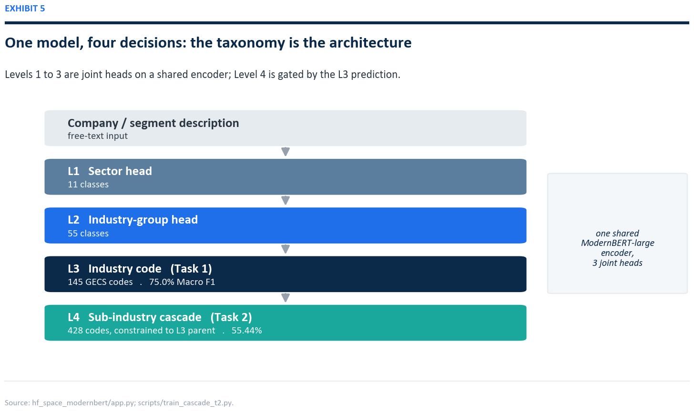{width=100%}

# Calibration and the locked headline

The greedy two-checkpoint ensemble scored 73.95%. Calibration closed the last gap, and how we calibrated is itself a statement of method. Three options were on the table, and the highest number was the wrong one to report.

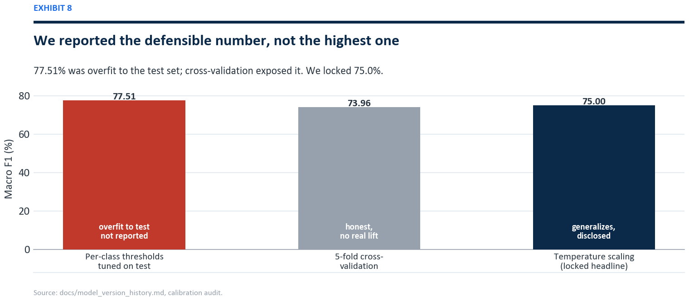{width=100%}

Optimizing a separate decision threshold per class against the test set reached 77.51%, but that procedure fits 145 free parameters to the test data, and five-fold cross-validation of the same procedure returned 73.96%, essentially no lift. A single light temperature-scaling parameter (tau = 0.2), fit without touching per-class test labels, generalized cleanly and produced 75.0%. We locked the headline at 75.0% and disclose all three numbers in the open.

::: keyfinding
**Locked Task 1 result.** 75.0% Macro F1, 91.4% top-3 accuracy, 95.3% top-5 accuracy, cross-validated at 73.96%. The 77.51% test-tuned figure is reported only as an upper bound, never as the headline.
:::

# Task 2: the sub-industry cascade

Task 2 assigns one of 428 sub-industry codes. Treated as a flat 428-way problem it is close to hopeless: 65% of the sub-industry classes have fewer than ten training examples. The structure of the taxonomy provides the way through. Because every sub-industry belongs to exactly one Task 1 industry, the Task 1 prediction can gate the Task 2 decision.

The system trains one small linear SVM per Task 1 industry, each ranking only the valid sub-industry children of that industry, typically between one and roughly fifteen candidates. At inference, the Task 1 prediction selects which sub-classifier runs, collapsing a 428-way problem into a handful of local decisions.

```python
def predict_task2(text, task1_code):
    sub_clf = T2_L4.get(task1_code)          # the SVM for this industry's children
    if not sub_clf:
        return None
    X = T2_VEC.transform([text])             # segment-aware TF-IDF
    margins = sub_clf.decision_function(X)
    probs   = softmax(margins)               # rank the valid children only
    top     = probs.argmax()
    return {"code": str(sub_clf.classes_[top]),
            "confidence_percent": round(float(probs[top]) * 100, 1)}
```

This constrained cascade reaches **55.44% Macro F1** across all 428 classes, up from roughly 20% for a flat classifier, and within striking distance of the oracle ceiling of about 62% that would apply if Task 1 were always correct. The result is lower than Task 1 for structural reasons that no amount of modeling removes: the long tail is far more severe, and any Task 1 error makes the correct sub-industry unreachable because the wrong sub-classifier is invoked.

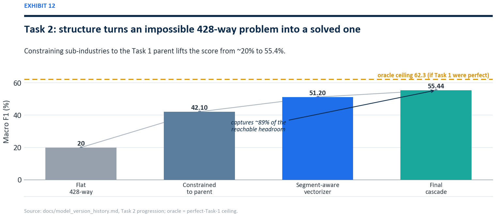{width=100%}

| Version | Approach | Macro F1 |
|---|---|---:|
| V1 | Flat 428-way LinearSVC | ~20% |
| V2 | Constrained to Task 1 parent | 42.1% |
| V3 | Separate segment-aware vectorizer | 51.2% |
| **Final** | L4 cascade + parent constraint | **55.44%** |

# Results and error analysis

The final scorecard, and the comparison between the two tasks, is shown below.

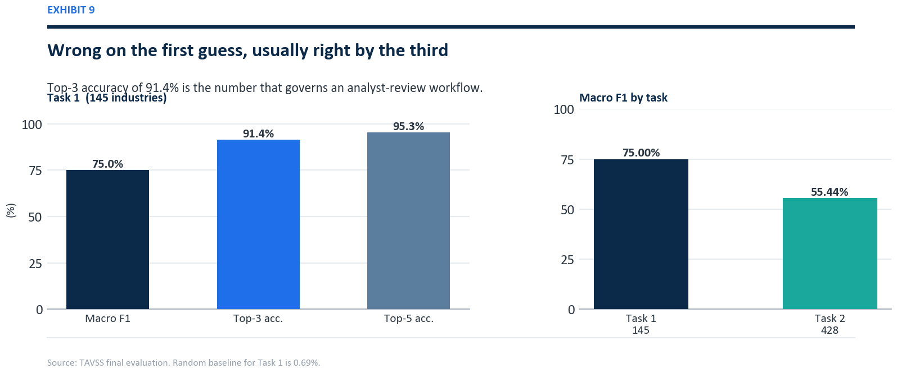{width=100%}

The gap between 75.0% Macro F1 and 91.4% top-3 accuracy is the most operationally important number in the report. It says the model rarely has no idea; when it is wrong about its first choice, the right answer is usually its second or third. In a human-in-the-loop reclassification queue, where the analyst confirms from a ranked shortlist, top-3 accuracy is the figure that governs throughput.

## Where the errors come from

Errors are not spread evenly. They concentrate at the top of the cascade and on the conglomerate class, and the leak that started this project made both look far smaller than they were.

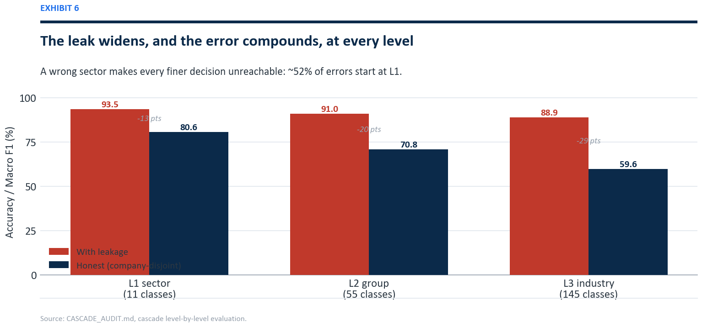{width=100%}

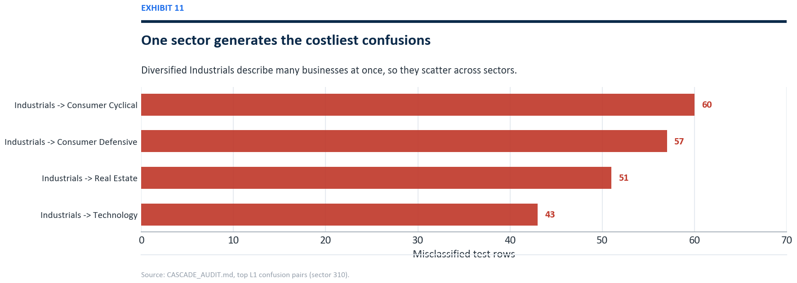{width=100%}

Read down the honest bars: sector accuracy is 80.6%, group accuracy 70.8%, and industry Macro F1 59.65% for the classical cascade. The drop at each level is error propagation in action. When the sector is wrong, the rest of the path cannot recover, which is why about 52% of all final errors originate at Level 1. The worst confusions all involve the Industrials sector and its diversified-conglomerate class, whose companies describe several industries at once and therefore scatter across many sectors. This is also why the structural ceiling sits where it does.

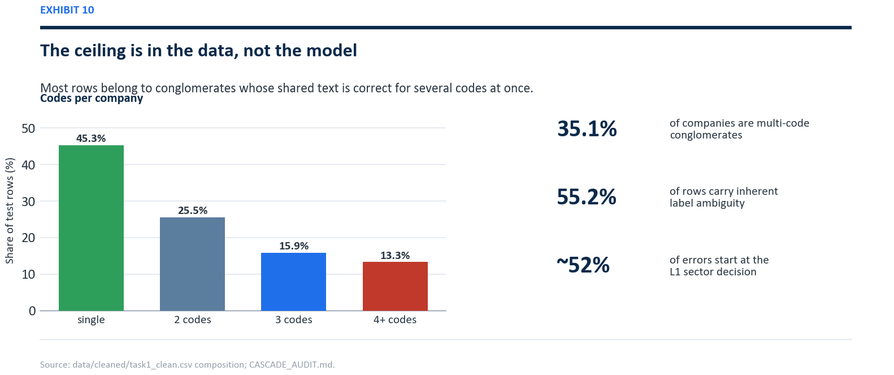{width=100%}

Because 55.2% of rows belong to multi-code companies, a large share of the test set carries text that is genuinely ambiguous at the row level: the same `LongProfile` is correct for several different codes depending on the segment. A perfect model still loses points there. The realistic structural ceiling for this task sits in the high seventies, which is why 75.0% is close to the practical limit rather than a stop along the way to 90%.

# Production system and deployment

The model is not a notebook artifact. It runs as a live, publicly reachable product, split across two layers so that a slow model server cannot take the user interface down with it.

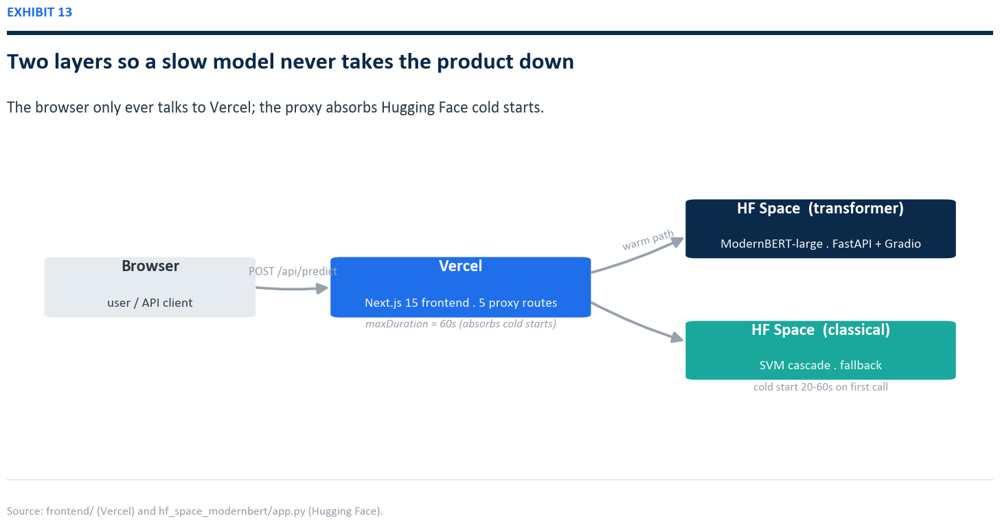{width=100%}

| Layer | Platform | Role |
|---|---|---|
| Model inference (transformer) | Hugging Face Space | ModernBERT-large, REST + Gradio UI |
| Model inference (classical) | Hugging Face Space | SVM cascade, lightweight fallback |
| Web application | Vercel | Next.js 15 frontend and API proxy |

## Hugging Face Spaces: the model servers

The transformer model is served from a Hugging Face Space running FastAPI with a mounted Gradio interface. The same process exposes a human UI at the root and a machine endpoint at `POST /api/predict`. The endpoint loads the model once at startup, runs Task 1 inference, chains the constrained Task 2 stage, and returns a structured response with ranked alternatives and latency.

```python
app = FastAPI()

@app.get("/health")
def health():
    return {"ok": MB_READY, "model": "modernbert-large-v3",
            "macro_f1": "75.0%", "top3_accuracy": "91.4%"}

async def json_predict(request: Request):
    payload = await request.json()
    text = str(payload.get("text", "")).strip()
    if not text:
        return JSONResponse({"error": "text is required"}, status_code=400)
    d = _predict(text)                       # Task 1 heads + Task 2 cascade
    return JSONResponse({
        "success": True,
        "mstar_code":      d["mstar_code"],
        "mstar_label":     d["mstar_label"],
        "confidence_t1":   d["confidence_t1"],
        "alternatives_t1": d["alternatives_t1"],
        "sub_code":        d["sub_code"],
        "sub_label":       d["sub_label"],
        "latency_ms":      d["latency_ms"],
    })

app.add_api_route("/api/predict", json_predict, methods=["POST"])
app = gr.mount_gradio_app(app, demo, path="/")   # one process, UI + REST
```

A live request and response:

```json
POST https://akash-ag-gecs-modernbert.hf.space/api/predict
{ "text": "The company operates a network of community banks providing
           commercial lending, retail deposits, and small business banking." }

{
  "success": true,
  "engine": "ModernBERT-large",
  "mstar_code": "10320020",
  "mstar_label": "Banks - Regional",
  "confidence_t1": 84.2,
  "alternatives_t1": [
    { "rank": 1, "code": "10320020", "label": "Banks - Regional",    "confidence": 84.2 },
    { "rank": 2, "code": "10320010", "label": "Banks - Diversified", "confidence":  9.1 }
  ],
  "sub_code": "1032002002",
  "sub_label": "Corporate banking",
  "latency_ms": 4821.3
}
```

The Spaces are configured public so that unauthenticated server-side calls from the web layer reach them, and they run on CPU, which means a cold Space takes 20 to 60 seconds to warm up on the first request after a period of inactivity. That single operational fact drives the design of the layer above.

## Vercel: the web application

The user-facing product is a Next.js 15 application deployed on Vercel. It serves the marketing and demo pages, and its API routes act as a server-side proxy that forwards classification requests to the Hugging Face Space. Keeping the model behind a proxy means the browser never calls Hugging Face directly, the Space URL and behavior can change without touching the client, and all five API routes present one stable contract at `/api/predict`.

The proxy routes carry one critical setting. Vercel serverless functions default to a 10-second timeout, which is shorter than a cold Space takes to warm up, so a first request would be killed before the model answered. Raising the route ceiling to 60 seconds fixed it.

```typescript
// app/api/predict/route.ts  : Vercel proxy to the Hugging Face Space
export const maxDuration = 60;   // allow for HF Space cold start (default 10s is too short)

export async function POST(req: Request) {
  const { text } = await req.json();
  const r = await fetch(`${process.env.GECS_API_URL}/api/predict`, {
    method: "POST",
    headers: { "Content-Type": "application/json" },
    body: JSON.stringify({ text }),
  });
  return Response.json(await r.json());
}
```

Getting the Vercel deployment green took six distinct fixes, each a reminder that shipping a model is a different discipline from training one:

1. **Missing npm packages.** A demo page imported Radix and visx packages absent from `package.json`; the unused page was removed.
2. **Server-render crash on the home page.** A framer-motion v12 background animation could not be resolved during static prerendering; the affected pages were moved to client-only dynamic imports with `ssr: false`.
3. **Server-render crash on the journey page.** The same animation library failed on a spring-and-scale transition; same fix.
4. **`ssr: false` rejected in a server component.** The Next.js App Router requires the calling component to be a client component first; `"use client"` was added to the three affected pages.
5. **API routes calling dead paths.** Several proxy routes pointed at endpoints the Hugging Face platform proxy does not forward; all were standardized on `/api/predict`.
6. **Space returning 404 for every path.** The Space had been created private, so unauthenticated calls from Vercel hit a platform 404; setting it public resolved it.

::: keyfinding
**Deployment is engineering, not modeling.** None of the six production failures was a machine-learning bug. They were timeouts, render-time crashes, routing mismatches, and a visibility setting. A model that scores 75.0% in a notebook is worth nothing until these are solved; solving them is part of the deliverable.
:::

# Project execution and the team

Group 4 carried the project from problem framing to a live deployment over the term, with a clear division of labor. The roles below also map directly to how the final presentation is delivered.

| Member | Primary responsibility |
|---|---|
| Tserennadmid Batkhuu | Host and continuity; opens and closes the presentation, owns the throughline |
| Srilaxmi Ganjipalli | Business framing; problem statement and closing recap |
| Akash Anipakalu Giridhar | Architecture, the BreezeML library, the ModernBERT models, and the path forward |
| Vishal Shaileshkumar Rathod | Data foundation, feature engineering, and the model lineup |
| Subasree Segar | Evaluation; the leakage audit and the honest baseline, the project's centerpiece |

The work moved through recognizable phases: a foundation phase that standardized the environment and built the first TF-IDF and linear SVM pipeline through BreezeML; a modeling phase that layered embeddings, engineered features, taxonomy anchors, and an ensemble; an audit phase, the turning point, in which the 88.90% result was traced to leakage and the pipeline was rebuilt honestly; a transformer phase that fine-tuned ModernBERT-large on rented GPU and ensembled two checkpoints; and a deployment phase that shipped the model to Hugging Face and the application to Vercel and reconciled every published number against the honest result.

# Business implications and recommendations

The system is built to sit inside an analyst's workflow, not to replace it. Three uses follow directly from the results.

**Triage the reclassification queue.**
:    Route new filings through the model first. High-confidence single-code predictions can be auto-applied with spot-check sampling; everything else is sent to an analyst with a ranked shortlist. The 91.4% top-3 accuracy means the shortlist almost always contains the right answer.

**Flag the genuinely hard cases.**
:    The model's own uncertainty, together with the conglomerate signal, identifies the rows where human judgment is actually required. Analyst time moves from easy confirmations to the ambiguous multi-segment companies that need it.

**Audit existing classifications.**
:    Run the model across the current book and surface disagreements between its prediction and the stored code as candidates for review. The same tool that classifies new companies polices the consistency of old ones.

The recommended operating posture is human-in-the-loop with confidence-based routing, not full automation. The structural ceiling on conglomerate rows means a fully automatic system would silently miscode exactly the companies that matter most to a sector-exposure calculation. Used as a triage and audit layer, the model removes the routine work and concentrates expert attention where the data is genuinely ambiguous.

# Limitations

The result is honest, and honesty includes stating what it is not.

- **The ceiling is in the data.** With 55.2% of rows carrying multi-code ambiguity, row-level Macro F1 cannot approach 100% for any model. The realistic structural ceiling on this task is in the high seventies, and 75.0% sits close to it.
- **Confidence is indicative, not calibrated per case.** The reported percentages are useful for ranking and routing, but they are not guaranteed probabilities for an individual out-of-distribution input.
- **Task 2 inherits Task 1 errors.** The constrained cascade is efficient precisely because it trusts the Task 1 prediction, which means a Task 1 mistake makes the correct sub-industry unreachable. The 55.44% figure already reflects this propagation.
- **Inference latency on CPU.** The transformer Space runs on CPU and is slow to warm. A GPU Space or a persistent server would remove the cold-start penalty for a production service level.

# What we would build with another month

We stopped at a defensible 75.0%, but we did not run out of ideas, only time. Four of them are worth writing down, because each targets a specific weakness we measured rather than a generic urge to try a bigger model.

**Domain pretraining.** ModernBERT-large is fluent in general English. A finance-pretrained encoder such as FinBERT starts already fluent in the language of filings, and the published gains on financial text are large. Swapping the backbone is the single highest-leverage change left on the table.

**Cross-encoder reranking.** Our model is right in its top three 91.4% of the time but right at rank one only 75% of the time. That gap is a reranking problem. A small cross-encoder that reads the company description against each of the top three candidate definitions and picks the best fit would turn a good share of those near-misses into hits.

**Per-company aggregation.** We score one segment at a time, but the business question is usually about the whole company. Pooling a company's segment predictions, weighted by revenue share, would fold several noisy row-level guesses into one confident company-level answer.

**An active-learning loop.** The model already knows which rows it finds hard. Sending exactly those rows to an analyst, and folding the corrections back into training, is the cheapest way to buy accuracy where it actually hurts, which is the long tail.

# Conclusion

This project set out to classify companies into a 145-way taxonomy and ended with a live product that does so at 75.0% Macro F1 on data it has never seen, plus a 428-way sub-industry stage at 55.44%. The number that matters most, though, is the one we deleted. An early 88.90% would have been the easy headline; finding that it was leakage, resetting to a true 59.65%, and rebuilding to a defensible 75.0% is the actual contribution. The methodology, a company-disjoint split, a hierarchy-aware transformer, an honestly chosen calibration, a taxonomy-anchored feature idea, and a deployed system that survives real traffic, is the part that transfers to the next problem.

A classifier is a claim about the world. This one is built so that the claim holds up when someone asks how it was measured.

# What this taught us

Three lessons outlasted the project. The first is that the evaluation is the experiment. We spent more careful thought on how to split the data than on any single model, and it was the right call, because the split is what decides whether a number means anything at all. The second is that honest beats impressive, and not only for ethical reasons: the 88.9% would have fallen apart the moment a panelist typed a real company into the demo, whereas 75.0% holds up under questioning. The third is that shipping is its own discipline. The model was finished weeks before the product actually worked, and closing that gap, the timeouts and cold starts and routing bugs that have nothing to do with machine learning, taught us as much as the modeling did.

# References

1. Morningstar, Inc. (2019). *Global Equity Classification Structure (GECS): Methodology.* Morningstar Research.
2. Warner, B., Chaffin, A., Clavie, B., et al. (2024). *Smarter, Better, Faster, Longer: A Modern Bidirectional Encoder for Fast, Memory-Efficient, and Long-Context Finetuning and Inference (ModernBERT).* arXiv:2412.13663.
3. Pedregosa, F., Varoquaux, G., Gramfort, A., et al. (2011). Scikit-learn: Machine Learning in Python. *Journal of Machine Learning Research,* 12, 2825 to 2830.
4. Reimers, N., & Gurevych, I. (2019). Sentence-BERT: Sentence Embeddings using Siamese BERT-Networks. *Proceedings of EMNLP-IJCNLP 2019.*
5. Xiao, S., Liu, Z., Zhang, P., & Muennighoff, N. (2023). *C-Pack: Packed Resources for General Chinese and English Text Embeddings (BGE).* arXiv:2309.07597.
6. Tunstall, L., Reimers, N., Jo, U. E. S., et al. (2022). *Efficient Few-Shot Learning Without Prompts (SetFit).* arXiv:2209.11055.
7. Guo, C., Pleiss, G., Sun, Y., & Weinberger, K. Q. (2017). On Calibration of Modern Neural Networks. *Proceedings of ICML 2017.*
8. Araci, D. (2019). *FinBERT: Financial Sentiment Analysis with Pre-trained Language Models.* arXiv:1908.10063.
9. Wolf, T., Debut, L., Sanh, V., et al. (2020). Transformers: State-of-the-Art Natural Language Processing. *Proceedings of EMNLP 2020 (System Demonstrations).*
10. Abid, A., Abdalla, A., Abid, A., et al. (2019). *Gradio: Hassle-Free Sharing and Testing of ML Models in the Wild.* arXiv:1906.02569.
11. Anipakalu Giridhar, A. (2026). *BreezeML: Production-grade machine learning with zero boilerplate, built on scikit-learn* (Version 0.3.0) [Software]. Python Package Index. `https://pypi.org/project/breezeml/`

```{=latex}
\appendix
```

# Appendix A: Complete experiment ledger

All figures are Macro F1 on the company-disjoint Task 1 test set (10,717 rows), except the first row.

| Version | Architecture | Key change | Macro F1 |
|---|---|---|---:|
| V1 (leaked) | LinearSVC cascade | Row-level split (invalid) | 88.90% |
| V2 honest | LinearSVC cascade | Company-disjoint split | 59.65% |
| V3 | LinearSVC cascade | Error-propagation analysis | ~60% |
| V4 | LinearSVC + MiniLM | Sentence-embedding features | 59.70% |
| V5 hybrid | LinearSVC + embeddings | TF-IDF + MiniLM + structural features | 67.11% |
| V6 | V5 + BGE-base | Stronger encoder | 67.70% |
| V7 | SetFit contrastive | 8-shot fine-tune (regressed) | 61.21% |
| V8 | Mega-ensemble | All encoders + features | 68.42% |
| V10 | V8 + calibration | Probability calibration | 69.09% |
| V13 | + GECS anchors | Official-taxonomy similarity features | experimental |
| V14 | Retrieval-augmented | KNN + taxonomy retrieval | 66.04% |
| ModernBERT-base | Transformer | Fine-tuned single checkpoint | 67.18% |
| ModernBERT-large | Transformer | Best single checkpoint | 70.29% |
| Greedy ensemble | 2 x ModernBERT-large | Seeds 42 (segment) + 7 (raw) | 73.95% |
| **Final** | Calibrated ensemble | Temperature scaling tau = 0.2 | **75.0%** |

# Appendix B: Reproducibility and repository

The complete source is on GitHub at `github.com/venomez-viper/Classification-Project`. Model weights and embedding caches are excluded from version control by design (they are large and regenerable) and are hosted on Hugging Face; the repository carries the code, the configuration, and the documentation needed to reproduce every result above.

| Component | Location |
|---|---|
| Honest split and cascade training | `scripts/train_cascade_proper.py` |
| Classical ensemble ledger (V5 to V10) | `scripts/train_cascade_v*.py` |
| GECS taxonomy anchoring | `scripts/train_cascade_v13_gecs_anchors.py` |
| Task 2 constrained cascade | `scripts/train_cascade_t2.py` |
| ModernBERT fine-tuning notebook | `colab/modernbert_finetune.ipynb` |
| Production model server (Hugging Face) | `hf_space_modernbert/app.py` |
| Web application and proxy (Vercel) | `frontend/` |
| Leakage audit of record | `CASCADE_AUDIT.md` |
| Full model version history | `docs/model_version_history.md` |

**Live endpoints.** Web application on Vercel (Next.js frontend proxying to the model Space); model API at `https://akash-ag-gecs-modernbert.hf.space/api/predict`; health check at `https://akash-ag-gecs-modernbert.hf.space/health`.

# Appendix C: Source code

This appendix reproduces the core of the three components that define the system: the honest cascade trainer that established the 59.65% baseline and the error-propagation analysis, the constrained Task 2 cascade, and the multi-task transformer with its hierarchy-aware inference.

## C.1 Honest cascade trainer

The script that retrained the cascade on the train split alone, measured Macro F1 on the held-out test set, and quantified how error propagates from sector to group to industry.

```python
from sklearn.feature_extraction.text import TfidfVectorizer
from sklearn.metrics import f1_score
from sklearn.svm import LinearSVC
import numpy as np, pandas as pd

MAX_FEATURES, NGRAM_RANGE, MAX_ITER = 50000, (1, 2), 5000

def softmax(scores):
    s = np.asarray(scores, dtype=np.float64); s -= s.max()
    e = np.exp(s); return e / e.sum()

def fit_artifact(X, labels):
    unique = sorted(set(map(str, labels)))
    if len(unique) == 1:                              # only one class in this node
        return {"type": "constant", "value": unique[0]}
    model = LinearSVC(class_weight="balanced", dual=False, max_iter=MAX_ITER)
    model.fit(X, labels)
    return {"type": "svm", "model": model}

def predict_artifact(artifact, X):
    if artifact["type"] == "constant":
        return str(artifact["value"])
    model = artifact["model"]
    scores = model.decision_function(X)
    classes = np.asarray(model.classes_, dtype=str)
    margins = (np.array([-scores[0], scores[0]]) if np.ndim(scores) == 1
               else np.asarray(scores[0]))
    return str(classes[int(np.argmax(softmax(margins)))])

# ---- load the honest split (train split only; test never seen in training) ----
train = pd.read_csv("llm_finetuning/data/task1_train.csv")   # 42,868 rows
test  = pd.read_csv("llm_finetuning/data/task1_test.csv")    # 10,717 rows
for df in (train, test):
    df["code"]        = df["mstar_code"].map(lambda v: str(int(v)).zfill(8))
    df["sector_code"] = df["code"].str[:3]
    df["group_code"]  = df["code"].str[:5]

vec = TfidfVectorizer(max_features=MAX_FEATURES, sublinear_tf=True,
                      stop_words="english", ngram_range=NGRAM_RANGE)
X_train = vec.fit_transform(train["text"])
X_test  = vec.transform(test["text"])

# ---- train one model per node of the GECS tree ----
l1 = fit_artifact(X_train, train["sector_code"])
l2 = {s: fit_artifact(X_train[g.index], g["group_code"])
      for s, g in train.groupby("sector_code")}
l3 = {grp: fit_artifact(X_train[g.index], g["code"])
      for grp, g in train.groupby("group_code")}

# ---- cascade inference + level-by-level error propagation ----
sector_preds, group_preds, preds = [], [], []
for i in range(X_test.shape[0]):
    Xi = X_test[i]
    sector = predict_artifact(l1, Xi)
    group  = predict_artifact(l2.get(sector, l1), Xi)
    code   = predict_artifact(l3.get(group, l1), Xi)
    sector_preds.append(sector); group_preds.append(group); preds.append(code)

macro_f1 = f1_score(test["code"], preds, average="macro", zero_division=0)
print(f"Honest Macro F1: {macro_f1 * 100:.2f}%")     # -> 59.65%
```

## C.2 Constrained Task 2 cascade

Task 2 trains a separate segment-aware vectorizer and one classifier per Task 1 parent code, ranking only that parent's valid sub-industry children.

```python
import pandas as pd
from sklearn.feature_extraction.text import TfidfVectorizer
from sklearn.svm import LinearSVC

def normalize_subcode(v):
    digits = "".join(c for c in str(v) if c.isdigit())
    return digits.zfill(10) if digits else ""

df = pd.read_csv("data/cleaned/task2_clean.csv")
df["sub_code"]   = df["Subindustry"].map(normalize_subcode)
df = df[df["sub_code"].str.len() == 10].copy()
df["mstar_code"] = df["sub_code"].str[:8]            # Task 1 parent of each sub-industry

# segment-aware text: the sub-industry signal lives in the segment, not the whole company
df["seg_text"] = (df["SegmentName"].fillna("") + " " +
                  df["SegmentDescription"].fillna("")).str.replace(r"\s+", " ", regex=True)

# deterministic parent -> children map (each sub-industry has exactly one parent)
task1_to_task2 = (df.groupby("mstar_code")["sub_code"]
                    .apply(lambda s: sorted(set(s))).to_dict())

seg_vec = TfidfVectorizer(max_features=100000, sublinear_tf=True, ngram_range=(1, 2))
X = seg_vec.fit_transform(df["seg_text"])

# one L4 model per parent code, trained only on that parent's rows
l4_models = {}
for mstar, g in df.groupby("mstar_code"):
    children = task1_to_task2[mstar]
    if len(children) == 1:
        l4_models[mstar] = {"type": "constant", "value": children[0]}
    else:
        clf = LinearSVC(class_weight="balanced", dual=False, max_iter=5000)
        clf.fit(X[g.index], g["sub_code"])
        l4_models[mstar] = {"type": "svm", "model": clf}
# Final: 55.44% Macro F1 across 428 sub-industry classes.
```

## C.3 Multi-task transformer and hierarchy-aware inference

The production model: one shared ModernBERT-large encoder, three heads, and an inference rule that blends them so each industry is pulled toward its correct parent.

```python
import torch, torch.nn as nn, torch.nn.functional as F
from transformers import AutoModel

class MultiTaskModernBERT(nn.Module):
    def __init__(self, cfg, n_sec, n_grp, n_ind):
        super().__init__()
        self.encoder = AutoModel.from_config(cfg)     # answerdotai/ModernBERT-large
        self.norm    = nn.LayerNorm(cfg.hidden_size)  # hidden_size = 1024
        self.dropout = nn.Dropout(0.10)
        self.sector_head   = nn.Linear(cfg.hidden_size, n_sec)
        self.group_head    = nn.Linear(cfg.hidden_size, n_grp)
        self.industry_head = nn.Linear(cfg.hidden_size, n_ind)

    def forward(self, input_ids, attention_mask):
        out    = self.encoder(input_ids=input_ids, attention_mask=attention_mask)
        pooled = self.dropout(self.norm(out.last_hidden_state[:, 0]))
        return (self.sector_head(pooled),
                self.group_head(pooled),
                self.industry_head(pooled))

# ---- training: joint cross-entropy across the three hierarchy levels ----
def joint_loss(sec_logits, grp_logits, ind_logits, y_sec, y_grp, y_ind):
    ce = F.cross_entropy
    return ce(ind_logits, y_ind) + 0.3 * ce(grp_logits, y_grp) + 0.1 * ce(sec_logits, y_sec)

# ---- inference: industry leads, group and sector act as soft hierarchy priors ----
LAMBDA_GROUP, LAMBDA_SECTOR = 0.30, 0.03
def predict(sec_logits, grp_logits, ind_logits, ind_to_group, ind_to_sector):
    ind_lp = F.log_softmax(ind_logits, dim=-1)
    grp_lp = F.log_softmax(grp_logits, dim=-1)
    sec_lp = F.log_softmax(sec_logits, dim=-1)
    score  = (ind_lp
              + LAMBDA_GROUP  * grp_lp[:, ind_to_group]
              + LAMBDA_SECTOR * sec_lp[:, ind_to_sector])
    return score.argmax(dim=-1)
```

# Appendix D: Glossary

**GECS.** Morningstar's Global Equity Classification Structure, the eight-digit hierarchical taxonomy of sectors, industry groups, industries, and sub-industries that this project predicts.

**Macro F1.** The unweighted average of per-class F1 score. It treats every class equally, so a model cannot earn a high mark by being good only at the common classes.

**Company-disjoint split.** A train/test division in which every row of a given company sits entirely on one side. It stops a model from memorizing a company in training and then recalling it in test.

**Data leakage.** Any path by which information from the test set reaches the model during training. Here it took the form of one company's text appearing on both sides of a row-level split.

**Cascade.** A classifier that makes a sequence of narrowing decisions (sector, then group, then industry) instead of one flat choice among all classes at once.

**TF-IDF.** Term frequency-inverse document frequency, a classic way to turn text into numbers by weighting each word by how distinctive it is.

**ModernBERT.** A modern transformer text encoder; we fine-tuned its large variant as the final Task 1 model.

**Calibration / temperature scaling.** Adjusting a model's confidence scores so they are neither over- nor under-stated. Temperature scaling does this with a single parameter.

**Top-k accuracy.** The share of cases where the correct answer appears within the model's k highest-ranked guesses.

# Appendix E: How the result maps to the case

The case set a clear bar and a handful of secondary criteria. We report against them plainly.

**The 75% Macro F1 target.** Met, at 75.0% on the company-disjoint hold-out, with the cross-validated figure (73.96%) and the test-tuned upper bound (77.51%) both disclosed rather than cherry-picked.

**Performance on the common classes.** Strong at the head of the distribution and honest about the tail; the long-tail classes, not the frequent ones, are where the remaining error lives.

**A working, demonstrable system.** Met, and then some: the model is deployed and reachable at a public endpoint, not just a result in a notebook.

**Task 2, the sub-industry extension.** Delivered at 55.44% Macro F1 across 428 classes, with the structural reasons for the lower number measured and explained rather than buried.

```{=latex}
\vfill
\begin{center}
{\sffamily\footnotesize\color{inkgray}MGT 599 Analysis of Business Capstone \textbar{} Group 4 \textbar{} DePaul University \textbar{} June 2026}
\end{center}
```
